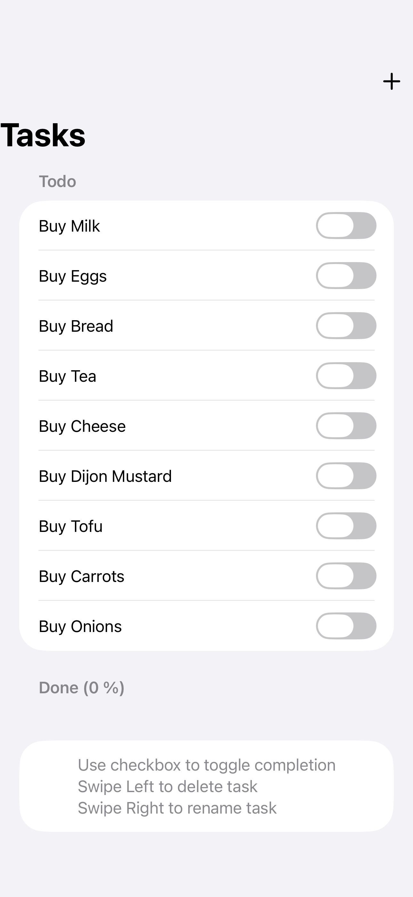

## Simple Swift 6.2 Todo App using modern 2026 MVVM architecture

1. Initially written using Combine 
2. Refactored to modern MVVM approach which doesn't use Combine

### Currently:
- `TaskViewModel.swift` is explicitly `@MainActor`, so all task mutations happen on the main actor.
- `ContentView.swift` stores the `@Observable` view model in `@State`, which is the modern SwiftUI pattern.
- The button and swipe closures in TaskRow are invoked from SwiftUI UI interactions, so they run through the main UI path and can call the main-actor view model methods.

### Changes made converting a traditional MVVM Combine inplementation:
- Replaced `NavigationView` with `NavigationStack` in `ContentView.swift`.
- Migrated `TaskViewModel` from `ObservableObject/@Published` to modern `@Observable` in `TaskViewModel.swift`.
- Changed `@StateObject` to `@State` for the observable view model.
- Removed unnecessary SwiftUI imports from the model/view model.
- Replaced row `.onTapGesture` with an accessible Button.
- Moved the task row into `TaskRow.swift`.
- Collapsed add/rename modal state into one enum-backed alert flow.
